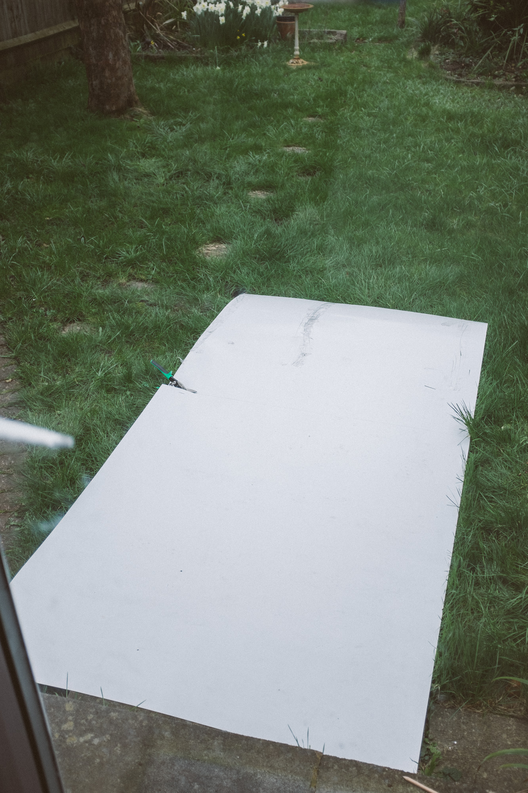
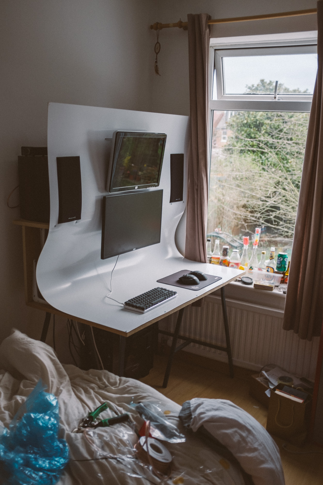
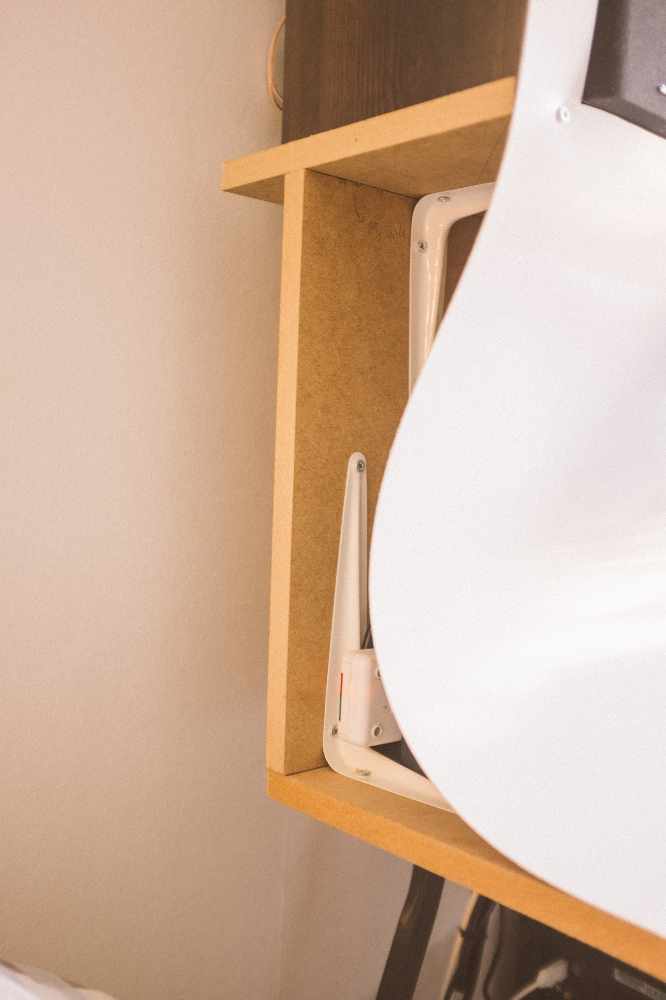

# Hackathon Desk Build

March 26 2017

I have been wanting to build a desk for a while, originally I just wanted to get a nice piece of wood and throw some legs on it but then I started to want something a bit more special. I started toying with this concept of one big piece of plastic an mounting everything into it flush (including the monitors which ended up out front). I have a reasonable amount of experience from using tools from my childhood as I have assisted on a lot of house DIY and did some work with aluminium. On the other hand I have never really designed and built anything myself, at least not at this scale. Having a hackathon coming up I decided to try and develop that skill also. One big issue was tooling. I am used to having a workshop full of tools and hardware, from where I used to work. This time I had to scrounge or buy the stuff I needed, I borrowed a drill, bought a wood saw, the tin cutters, drill bits and sand paper. Screw driver I had. I got lucky that I didn't need anything other than what I gathered in advance. I really don't know how I got away with that, the planning was pretty haphazard. In total I think i spent around £170-180. That is with tools included. Hope you find it interesting!

This was the old desk, I had a lot of gear that I was already happy with, but the desk was letting the setup down a bit.

This is about as complex as the drawings got, there are others scattered around different notebooks but this gives you an idea of how much it was just in my head (not a good idea). Its lucky that something didn't go drastically wrong.

  

The key materials, 2440x1220x1.5mm white PVC Sheet, two 1220x606x18mm MDF boards, a Duronic vertical twin monitor stand and two £5 trestles from ikea.

The trestles will support the desk but also will be the workbench, so they went up first.

  

Done, I think a bargin for £5 each. They look great and they are pretty sturdy.

Started planning out the speaker stands. these are just cut out of the MDF and then remounted on shelving brackets.

  

Cheap shelving brackets are most of the structure of the build, they made the assembly so much easier, I was originally planning on cutting brackets out of MDF. All the affixing was done by drilling 3mm holes and using 20x4mm self tapping wood screws. I found hand screwing was best. MDF is wonderfully easy to work with.

Speaker stands done!

  

I cut a hole for the monitor stand to be adjustable and triangles so that plugs can be pushed though also. Then planning out the shelving brackets to hold the back board in place.

Cut-outs done, this was probably the slowest part of the build as the plastic was a bit hard to cut. It also needed to be precise so a reasonable amount of care was taken.
  

Speaker, monitor stands and back board in place, looking like a desk now.

We had a lan on the overnight of the hackathon, I set the desk up to test it out and use for the lan. I like how it is at this stage. If i didn't use the plastic, it could use some paint but would still make a great desk!

  

Next day. Cutting the plastic to size so I can start planning the speaker and monitor cut outs. I used tin cutters, it worked really well which is lucky because I actually had no idea what to use and just bought them in the hardware store on a whim.

Screwed the front of the plastic in so its lined up to do the cutouts.

  

Desk put in its final position. you can see that the top of the plastic was just cable ties to the monitor stand. This is the flaws caused by not planning enough but it holds ok and is hidden by the monitors.

Computer parts installed. The only thing that I think didn't come together well is that there are gaps around the speakers where the plastic is still in a curve, this I am planning to fix at some point but is not too noticeable.

A week later, here is it in all its glory!

The PC just sits below.

I mostly use the desk/PC for gaming and just watching videos/browsing the web. I enjoy it so much more than with the old desk.

I was planning on eventually covering the sides but i love the contrast of the curve with the angular frame so I will now leave it exposed.

The monitor layout.

I love this keyboard. Ajazz AK33 (blue switches) with KBC PBT keycaps.

The 19 inch 1440x900 monitor could do with replacing so i left space for a 27 inch to be swapped out. Also a blue snowball mic because r/battlestations

The speakers sound amazing in this setup. Wharfedale Diamond 9.1s connect to an s.m.s.l SA-50. (Good setup if you ignore the Amp spitting out sparks when you plug it in.....[I'm not an audiophile though])

The PC its connected to. Nothing crazy but I have invested a reasonable amount into it. i5 with a cooler master hyper 212, 8gb ddr3 RAM, two miss-matched gtx760s, two SSDs (linux and windows) and three mechanical hard drives.
